# 📌 Overview

This write-up covers **CS50 Week 2**, where the course dives deeper into **memory, arrays, debugging, and how data is actually stored inside a computer**.

Unlike earlier concepts that focused on program structure and logic, this week focuses on **how data physically exists in memory and how programs manipulate it**.

Key ideas introduced include:

* How programs are compiled into machine instructions
* How debugging works
* How memory stores different data types
* Why arrays are essential for storing multiple values
* How strings work internally in C

These concepts push programmers to think not just about **writing code**, but about **how the computer interprets and stores that code**.

---

# In this write-up, we cover

* The four stages of compiling
* Debugging fundamentals
* Memory and data types
* Arrays and contiguous memory
* Strings in C

---

## 🛠 Core Concepts & Tools

The following components are central to this week's concepts:

```
C language        → Low-level systems programming
Clang / GCC      → Compilers that translate C into machine code
Debugger tools   → Identify and fix program bugs
RAM              → Temporary memory storage
Arrays           → Data stored in contiguous memory
```

---

# 🧭 Walkthrough

## 1️⃣ The Compilation Process

Compiling is the process of converting **human-readable source code into machine-readable instructions**.

When you write a program in C, the computer cannot run it directly. A compiler translates that program into **binary instructions the CPU can execute**.

Example C program:

```c
#include <stdio.h>

int main()
{
    printf("Hello World\n");
    return 0;
}
```

Compilers such as **Clang** or **GCC** convert this code into machine instructions.

Although we often say *“compile the program”*, the compilation process actually consists of **four stages**.

---

### 1️⃣ Preprocessing

Before compilation begins, the **preprocessor** handles special directives.

Example:

```c
#include <stdio.h>
```

The `#` symbol tells the compiler that this instruction should be handled **before compilation**.

During preprocessing:

* Header files are inserted
* Macros are expanded
* Comments are removed

Essentially, the compiler prepares the code for the next stage.

---

### 2️⃣ Compiling

In this step, the compiler converts **C code into assembly language**.

Assembly is a **low-level representation of instructions** that are much closer to machine language.

```
C code → Assembly instructions
```

This stage also checks for **syntax errors**.

---

### 3️⃣ Assembling

The assembler converts the **assembly instructions into binary machine code**.

Binary instructions are what the **CPU actually executes**.

Example format:

```
10101010 00101100 11010101
```

At this point, the program exists as machine-readable instructions.

---

### 4️⃣ Linking

In the final step, the compiler connects your program with **external libraries**.

For example, when using:

```c
printf()
```

The actual implementation of `printf` exists inside a standard library.

The **linker connects your program to that compiled library code**.

Without linking, your program would not know where those functions exist.

---

# 🐞 Debugging

Bugs are **errors in programs that cause incorrect behavior**.

Debugging is the process of **identifying, locating, and fixing those errors**.

Common debugging techniques include:

* Reading error messages carefully
* Using `printf()` statements to inspect variables
* Running programs step-by-step using a debugger

Debugging is a crucial programming skill because **even small mistakes can break program logic**.

---

# 💾 Memory & Data Types

Computers store program data inside **RAM (Random Access Memory)**.

RAM is:

* Extremely fast
* Used for short-term storage
* Volatile (data disappears when power is off)

We can imagine RAM as a **large grid of tiny storage locations**, where each square represents **one byte**.

<p align="center">
  
</p>

Different data types occupy different numbers of bytes.

---

### Common Data Types

| Type   | Typical Size | Purpose                 |
| ------ | ------------ | ----------------------- |
| char   | 1 byte       | Single character        |
| bool   | 1 byte       | True or False           |
| int    | 4 bytes      | Whole numbers           |
| float  | 4 bytes      | Decimal numbers         |
| double | 8 bytes      | High-precision decimals |
| long   | 8 bytes      | Large integers          |

⚠ Sizes may vary depending on the system architecture.

Understanding memory usage matters because **every variable occupies space in RAM**.

For example:

* A `char` uses **1 byte**
* An `int` uses **4 bytes**

This means an integer occupies **four memory cells**, while a character occupies only one.

---

# 📦 Arrays

An **array** is a collection of values stored in **contiguous memory locations**.

Instead of creating multiple variables, arrays allow us to store many values under a single name.

Syntax:

```c
type name[length];
```

Example:

```c
int houses[5];
```

This creates an array capable of storing **five integers**.

Memory representation:

```
houses[0]
houses[1]
houses[2]
houses[3]
houses[4]
```

Each element occupies space directly next to the previous one in memory.

Because arrays are contiguous, the computer can efficiently access elements using their **index position**.

---

# 🔤 Strings in C

Unlike many modern languages, **C does not have a built-in string type**.

Instead, a **string is actually an array of characters**.

Example:

```c
char name[] = "Alice";
```

Internally stored as:

```
A | l | i | c | e | \0
```

The `\0` character is called the **null terminator**, and it tells the computer **where the string ends**.

Because strings are character arrays, their memory size depends on **how many characters they contain**.

This is why string size is often represented as:

```
string → ? bytes
```

The size varies depending on the string length.

---

# 🧠 What This Week Teaches

CS50 Week 2 deepens understanding of how computers execute programs.

Key lessons include:

* Compiling is a multi-stage transformation process
* Programs must be linked with external libraries
* Debugging is an essential programming skill
* Every variable occupies space in RAM
* Arrays store multiple values in contiguous memory
* Strings are implemented as character arrays in C

These concepts move programming from **pure logic to system-level thinking**.

---

# 📌 Conclusion

Week 2 of CS50 expands the programmer’s perspective beyond writing code.

It introduces the underlying mechanisms that make programs possible:

* Compilation pipelines
* Memory allocation
* Data representation
* Structured storage through arrays

Understanding these concepts is essential for building efficient programs and for developing a deeper appreciation of **how computers actually work beneath the code**.

**Programming is not just writing instructions — it is understanding how machines execute them.**

---


# Author: [QQQ](#)

