This guide explains the **core fundamentals of Kotlin programming**, focusing on the essential concepts required to build modern applications and understand how Kotlin simplifies JVM development.

This write-up focuses on the following fundamentals:

* Understanding Kotlin syntax and program structure
* Working with variables and data types
* Implementing control flow using conditions and loops
* Writing reusable functions
* Understanding object-oriented programming concepts in Kotlin

---

## 🛠 Tools

Basic development tools used when learning Kotlin programming.

```bash
Kotlin Compiler      → compiling Kotlin programs
IntelliJ IDEA        → primary IDE for Kotlin development
VS Code              → alternative code editor
kotlinc              → Kotlin compiler
Terminal             → running compiled programs
```

---

## 📌 Overview

Kotlin is a modern programming language designed to run on the **Java Virtual Machine (JVM)** while offering a more concise and expressive syntax than Java.

Kotlin is widely used for:

* Android application development
* backend systems
* web services
* modern JVM applications

Kotlin is designed to be:

* **Concise and expressive**
* **Null-safe**
* **Fully interoperable with Java**
* **Object-oriented and functional**

Because Kotlin runs on the JVM, it can **use existing Java libraries and frameworks**, making it highly practical in real-world development environments.

---

## 🔍 Understanding Kotlin Program Structure

A simple Kotlin program is more concise than Java.

Example:

```kotlin
fun main() {
    println("Hello Kotlin")
}
```

In Kotlin:

* `fun` defines a function
* `main()` is the entry point of the program
* `println()` prints output to the console

Unlike Java, Kotlin does not require wrapping everything inside a class for simple programs.

---

## ⚙️ Variables and Data Types

Variables in Kotlin can be declared using **`val`** or **`var`**.

* `val` → immutable (cannot change value)
* `var` → mutable (value can change)

Example:

```kotlin
fun main() {

    val name: String = "Mysto"
    var age: Int = 22
    val balance: Double = 1540.75
    val active: Boolean = true

    println("Name: $name")
    println("Age: $age")
    println("Balance: $balance")
    println("Active: $active")
}
```

Common Kotlin data types include:

| Data Type | Description     |
| --------- | --------------- |
| Int       | Integer numbers |
| Double    | Decimal numbers |
| String    | Text            |
| Boolean   | True / False    |

Kotlin also provides **type inference**, meaning the compiler can often determine the variable type automatically.

Example:

```kotlin
val username = "Mysto"
```

---

## 🔁 Control Flow (Conditions & Loops)

Programs make decisions using conditional statements.

Example:

```kotlin
fun main() {

    val score = 75

    if (score >= 60) {
        println("Pass")
    } else {
        println("Fail")
    }
}
```

Kotlin also supports loops for repeated execution.

Example:

```kotlin
fun main() {

    for (i in 1..5) {
        println("Iteration $i")
    }

}
```

The `1..5` syntax represents a **range** in Kotlin.

---

## 🧠 Functions and Code Reusability

Functions allow developers to organize logic and reuse code.

Example:

```kotlin
fun multiply(a: Int, b: Int): Int {
    return a * b
}

fun main() {
    val result = multiply(4, 5)
    println(result)
}
```

Benefits of functions:

* code reusability
* better program organization
* improved readability
* easier debugging and testing

Kotlin also allows **single-expression functions**:

```kotlin
fun add(a: Int, b: Int) = a + b
```

---

## 📦 Introduction to Object-Oriented Programming

Kotlin supports object-oriented programming using classes.

Example:

```kotlin
class Employee(val name: String, var salary: Double) {

    fun displayInfo() {
        println("Employee: $name")
        println("Salary: $salary")
    }

    fun increaseSalary(percent: Double) {
        salary += salary * percent / 100
    }
}

fun main() {

    val emp = Employee("Mysto", 1200.0)

    emp.displayInfo()

    println("Applying salary increase...\n")

    emp.increaseSalary(10.0)
    emp.displayInfo()
}
```

This introduces:

* classes
* objects
* properties
* class methods

Core OOP principles include:

* Encapsulation
* Inheritance
* Polymorphism
* Abstraction

---

## 🧠 What This Write-Up Covers

* Understanding Kotlin syntax and program structure
* Writing simple and structured Kotlin programs
* Using variables, conditions, loops, and functions
* Building reusable logic with functions
* Understanding object-oriented programming in Kotlin

These concepts provide the **foundation required for modern Android and JVM development**.

---

## 🎓 Skills Gained From This Study

After studying and practicing these concepts, the following foundational skills were developed:

* Writing structured Kotlin programs
* Understanding Kotlin syntax and JVM execution
* Implementing logic with conditions and loops
* Organizing reusable code with functions
* Creating simple object-oriented Kotlin classes

These skills prepare developers for advanced topics such as:

* Android development
* Kotlin coroutines
* backend development
* REST API services
* modern application architecture

---

## 📌 Conclusion

Kotlin has become one of the most important programming languages for modern JVM development.

Its concise syntax, safety features, and interoperability with Java make it a powerful tool for building scalable applications.

Understanding Kotlin fundamentals helps developers write **cleaner, safer, and more maintainable code** while preparing them for advanced development environments.

Like all programming skills, mastery comes through **consistent practice and building real projects**.



# Author:[Mysto](https://www.linkedin.com/in/moussa-mohamed-1a15a536b/)


